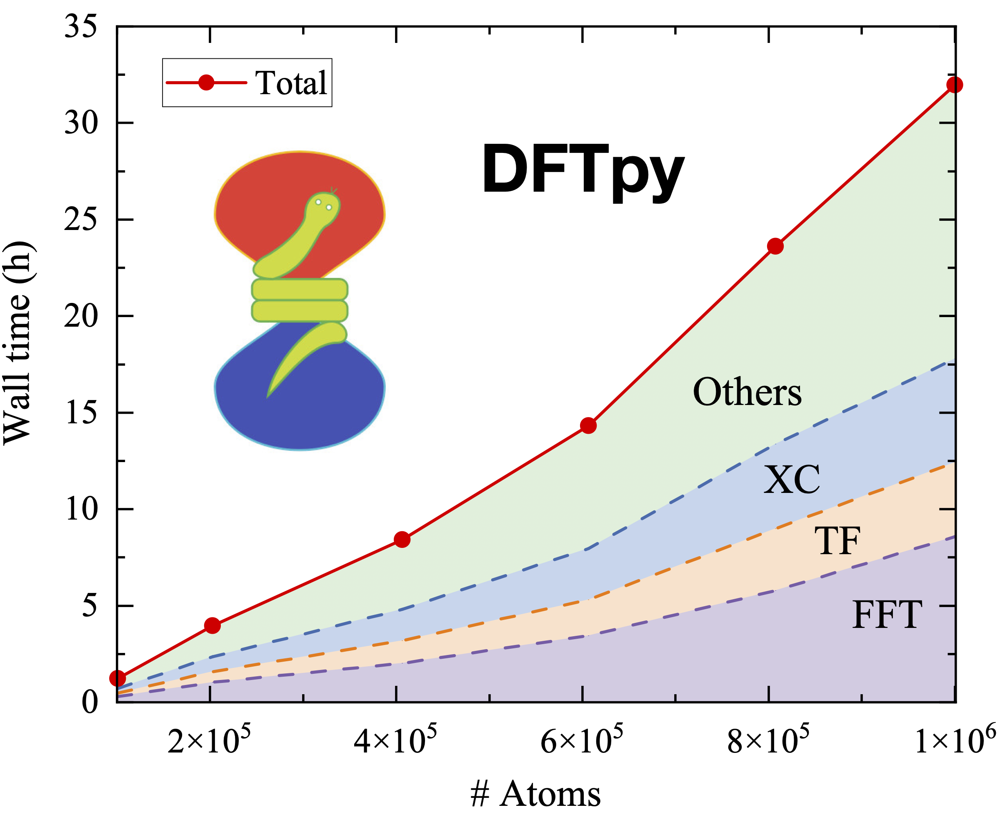

***"The underlying physical laws necessary for the mathematical
  theory of a large part of physics and the whole of chemistry are
  thus completely known, and the difficulty is only that the exact
  application of these laws leads to equations much too complicated to
  be soluble. It therefore becomes desirable that approximate
  practical methods of applying quantum mechanics should be developed,
  which can lead to an explanation of the main features of complex
  atomic systems without too much computation."***  
  -- **Paul Dirac**, [Quantum mechanics of many-electron systems](https://royalsocietypublishing.org/doi/10.1098/rspa.1929.0094) (1929)
* Orbital-Free Density Functional Theory (OF-DFT)
   *  Kinetic Energy Density Functionals (KEDFs)
   *  Local pseudopotentials (LPP)
   *  OF-DFT solver 
* Density Embedding/Subsystem Density Functional Theory (sDFT) 
	* Nonlocal sDFT
	* Nonadditive KEDFs
	* Deorbitalized Meta-GGA exchnage-correlation functionals
* Why Orbital Free Density Functional Theory (OF-DFT)
  * It can simulate millons atom with 1 CPU
  * 100+ millions of atoms by parallel computing  
    

